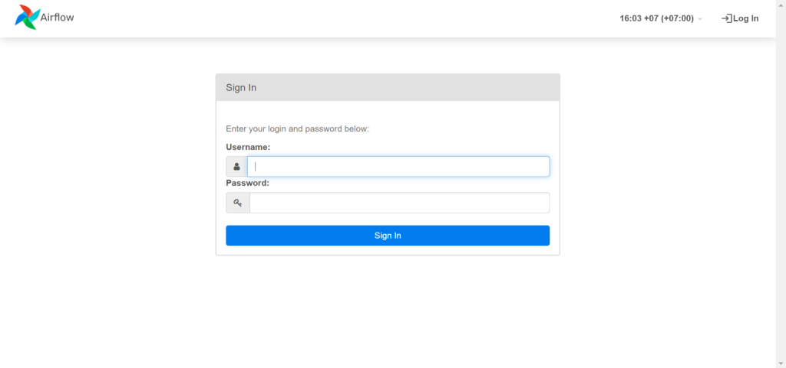
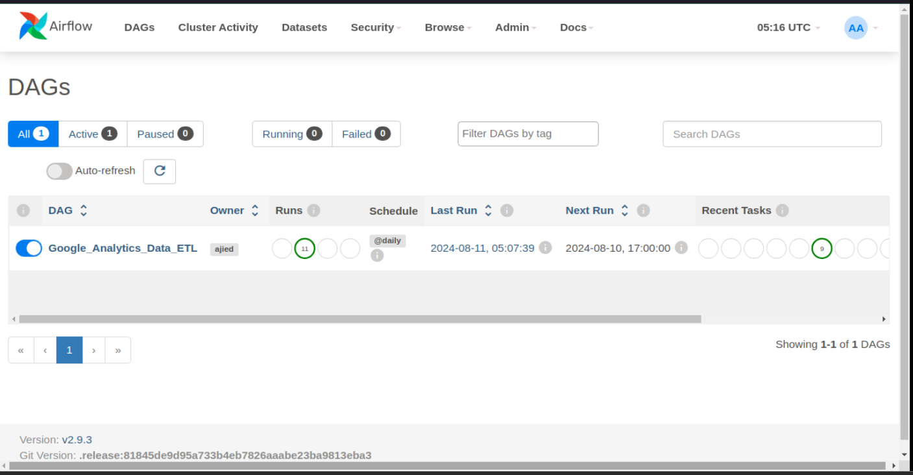
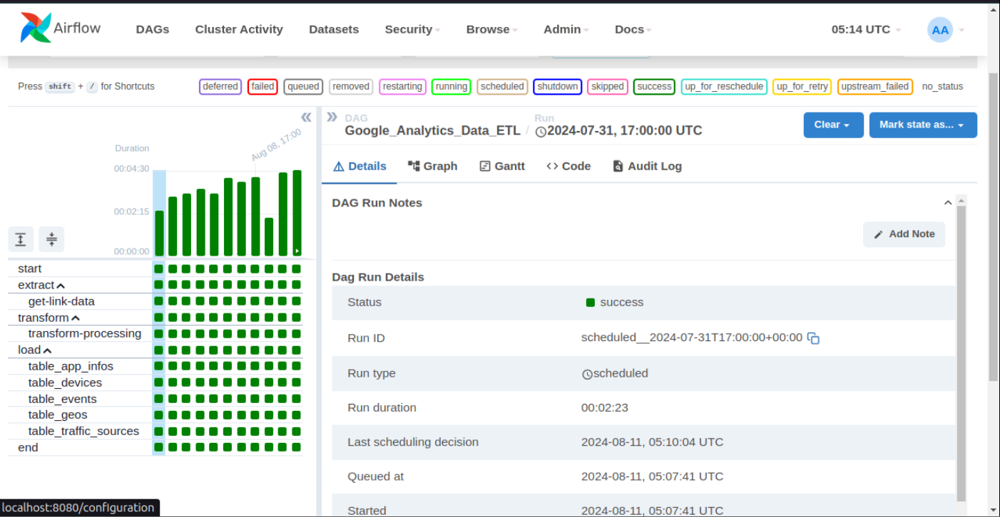
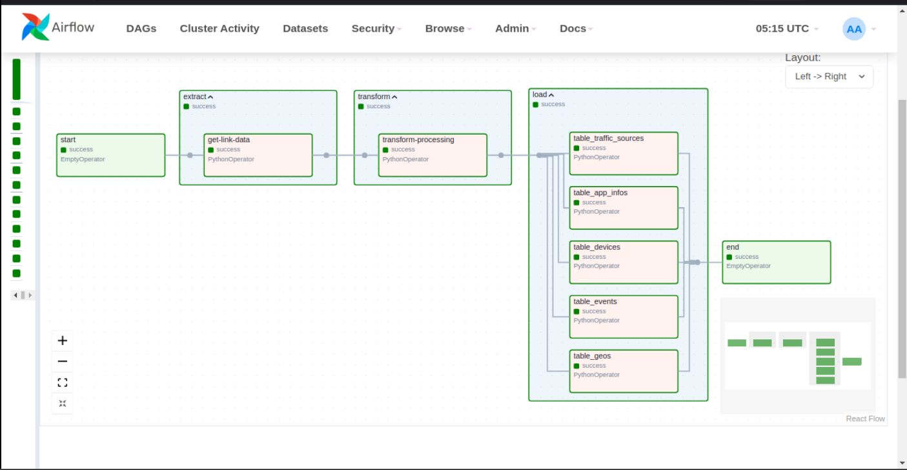
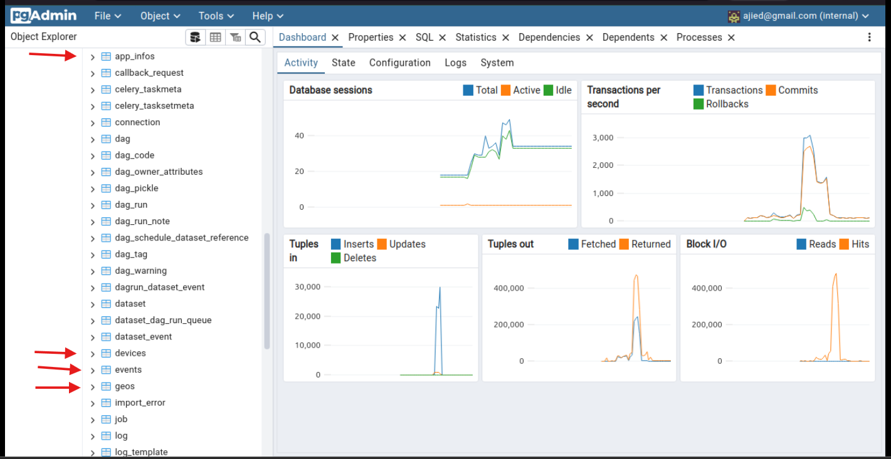

# Google Analytics Data ETL with Python and Apache Airflow @Dibimbing.id

## Overview

Proyek ini mengimplementasikan proses ETL (Extract, Transform, Load) untuk data Google Analytics menggunakan Python dan Apache Airflow. Data diekstrak dari sumber JSON, ditransformasikan ke dalam bentuk tabel yang siap dimuat, dan kemudian dimasukkan ke dalam PostgreSQL. 

Proses ini diotomatisasi menggunakan Apache Airflow yang memungkinkan penjadwalan tugas ETL secara berkala.

## Project Structure
.
├── app/

│ ├── init.py

│ ├── Extract_data.py

│ ├── Transform_data.py

│ └── Load_data.py0

├── dags/

│ └── google_analytics_etl.py

├── docker-compose.yaml

└── README.md

- `app/`: Folder ini berisi semua script Python untuk ekstraksi, transformasi, dan loading data.
- `dags/`: Folder ini berisi DAG Airflow yang mendefinisikan alur kerja ETL.
- `docker-compose.yaml`: File ini digunakan untuk menjalankan layanan Airflow, PostgreSQL, dan Redis menggunakan Docker Compose.
- `README.md`: Dokumentasi proyek.

## Prerequisites

- [Docker](https://www.docker.com/get-started)
- [Docker Compose](https://docs.docker.com/compose/install/)
- [Git](https://git-scm.com/downloads)

## Setup & Installation

1. **Clone the Repository**:
    ```bash
    git clone https://github.com/Ajied21/ETL_with_Python_Airflow_Dibimbing.id.git
    ```

2. **Build and Start Services**:
    Pastikan Anda berada di direktori proyek, kemudian jalankan perintah berikut untuk membangun dan menjalankan layanan Airflow, PostgreSQL, dan Redis:
    ```bash
    docker-compose up -d
    ```

3. **Access Airflow Web UI**:
    Setelah layanan berjalan, Anda dapat mengakses UI web Airflow di:
    ```
    http://localhost:8080
    ```
    Gunakan username dan password yang sesuai untuk masuk.
   
4. **Access Pgadmin4 Web UI**:
    Setelah layanan berjalan, Anda dapat mengakses UI web Pgadmin4 di:
    ```
    http://localhost:8585
    ```
    Gunakan username dan password yang sesuai untuk masuk.

## Running the ETL Process

ETL process berjalan otomatis setiap hari sesuai dengan penjadwalan DAG di Airflow. Untuk menjalankan DAG secara manual:

1. Buka UI web Airflow.
2. Aktifkan DAG `Google_Analytics_Data_ETL`.
3. Klik pada tombol play untuk menjalankan DAG secara manual.

## Output

Setelah proses ETL selesai, data yang telah ditransformasi akan dimuat ke dalam tabel berikut di database PostgreSQL:

- `app_infos`
- `devices`
- `events`
- `geos`
- `traffic_sources`

Anda dapat memverifikasi data yang dimuat dengan mengakses database PostgreSQL melalui pgAdmin atau klien SQL lainnya.

- login airflow


- menu airflow


- success running airflow


- DAG airflow


- output data in database with postgreSQL


## Error Handling

1. **Connection Error**: Jika ada masalah saat menghubungkan ke PostgreSQL, pastikan layanan PostgreSQL berjalan dan kredensial yang digunakan benar.
   - **Solution**: Periksa koneksi jaringan dan parameter koneksi di script `Load_data.py`.

2. **Data Transformation Errors**: Jika terjadi kesalahan selama transformasi data (misalnya, kesalahan tipe data), data yang tidak sesuai akan diabaikan atau dikonversi.
   - **Solution**: Anda dapat mengubah pengaturan tipe data di script `Transform_data.py` untuk menyesuaikan dengan kebutuhan.

3. **Airflow Task Failure**: Jika salah satu tugas di Airflow gagal, tugas tersebut akan otomatis diulang sesuai dengan pengaturan `retries`. Jika kegagalan terus terjadi, Anda akan menerima notifikasi email.
   - **Solution**: Periksa log Airflow di UI web untuk mengidentifikasi penyebab kesalahan dan lakukan perbaikan yang diperlukan.

## Cleanup

Untuk menghentikan semua layanan dan menghapus container, network, dan volume yang dibuat:

```bash
docker-compose down --volumes


### Penjelasan dan Error Handling

- **Error Handling**: Penanganan error disesuaikan dengan kemungkinan kesalahan yang dapat terjadi selama proses ETL, seperti kesalahan koneksi ke database atau kesalahan tipe data selama transformasi.
- **Running the ETL Process**: Dijelaskan bagaimana menjalankan DAG secara manual melalui UI Airflow.
- **Output**: Menguraikan tabel yang dihasilkan di PostgreSQL setelah proses ETL.

Jika Anda ingin menambahkan atau mengubah informasi tertentu, Anda bisa memperbarui file README.md sesuai kebutuhan.

